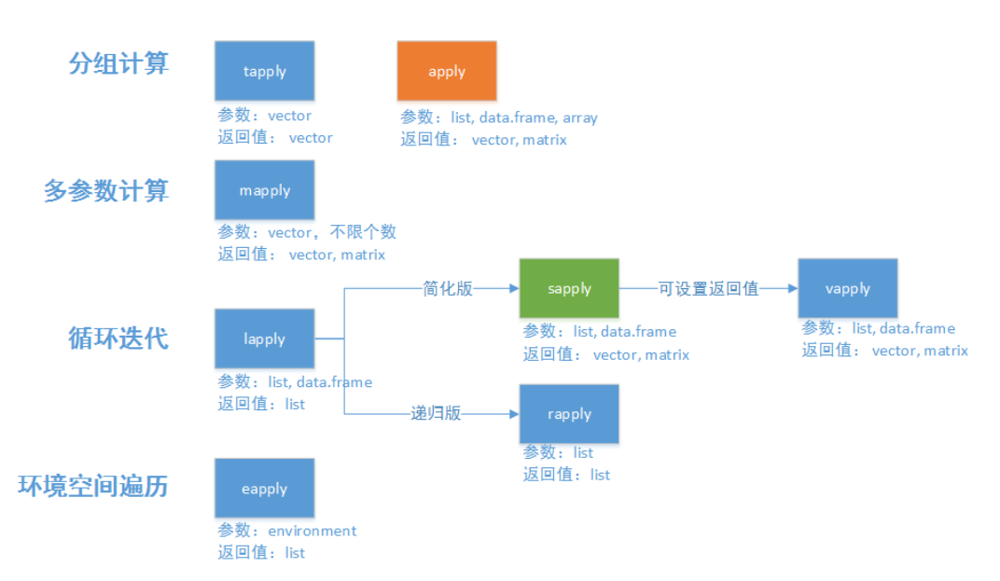

> &#9730;Author: chenshuo
# R中的数据存储
二进制，0.8无法精确表示  

0.8*2=1.6  取1<br>0.6*2=1.2  取1<br>0.2*2=0.4 取0<br>0.4*2=0.8 取0 <br>0.8表示成 0.1100<br>
# 逻辑向量做索引
```
> a <- c(TRUE,FALSE,FALSE,FALSE,TRUE)
> b <- c(13,7,8,2)
> b[a]
[1] 13 NA
```
```
> a <- c(3,6,9)
> a[a>6]
[1] 9
> b <- c(-1,8,3)
> b[b>a]
[1] 8
```
# DataFrame
## 常用操作
```
> head(women,3)             #head
  height weight
1     58    115
2     59    117
3     60    120
> tail(women,3)             #tail
   height weight
13     70    154
14     71    159
15     72    164
> nrow(women)               #nrow
[1] 15
> ncol(women)               #ncol
[1] 2
> dim(women)                #dim
[1] 15  2
> str(women)
'data.frame':	15 obs. of  2 variables:
 $ height: num  58 59 60 61 62 63 64 65 66 67 ...
 $ weight: num  115 117 120 123 126 129 132 135 139 142 ...
```
## 查询
```
> women[2,2]
[1] 117
> women[2,]
  height weight
2     59    117
> women[1:3,1]
[1] 58 59 60
```
```
> women$weight
[1] 115 117 120 123 126 129 132 135 139 142 146 150 154 159 164
```
```
> women$height[women$weight>140]        
[1] 67 68 69 70 71 72
```
# List
>&#10052;list可以存放长度不同的列<br>
>&#10052;dataframe只能存放长度相同的列  
```
> x <- c(3,2,3)
> y <- c("a","bc")
> z <- list(x,y)
> z
[[1]]
[1] 3 2 3

[[2]]
[1] "a"  "bc"

```
# <font color = 'red'>**apply家族函数**</font>
> 
## apply
- apply(X, MARGIN, FUN, ...)
- 行或列遍历操作
- X ：array（包括matrix）
- MARGIN = 1按行操作<br>MARGIN = 2按列操作
- 返回类型 vector
```
> a <- matrix(1:12,c(3,4))
> a
     [,1] [,2] [,3] [,4]
[1,]    1    4    7   10
[2,]    2    5    8   11
[3,]    3    6    9   12
```
MARGIN = 1
```
> aa <- apply(a,1,sum)
[1] 22 26 30
```
返回类型vector
```
> is.vector(aa)        
[1] TRUE
```
MARGIN = 2
```
> apply(a,2,sum)
[1]  6 15 24 33
```
## lapply
- lapply(list, function, ...)
- 列表遍历，按列操作
- 输入的数据必须是List/datafram<br>返回List  

构造dataframe: a_df
```
> a
     [,1] [,2] [,3] [,4]
[1,]    1    4    7   10
[2,]    2    5    8   11
[3,]    3    6    9   12
> a_df <- data.frame(a)
> a_df
  X1 X2 X3 X4
1  1  4  7 10
2  2  5  8 11
3  3  6  9 12
```
输入类型list/dataframe
```
> is.list(a_df)       
[1] TRUE
> is.data.frame(a_df)
[1] TRUE
```
lapply对列操作
```
> y <- lapply(a_df, function(x) sum(x))
> y
$X1
[1] 6

$X2
[1] 15

$X3
[1] 24

$X4
[1] 33
```
lapply返回类型list
```
> is.list(y)          
[1] TRUE
```
## sapply
- sapply(list, function, ..., simplify)
- simplify=F：返回值的类型是list，此时与lapply完全相同
- simplify=T（默认值）：返回值的类型由计算结果定。<br>如果函数返回值长度为1，则sapply将list简化为vector；<br>如果返回的列表中每个元素的长度都大于1且长度相同，那么sapply将其简化位一个矩阵
```
> a_df
  X1 X2 X3 X4
1  1  4  7 10
2  2  5  8 11
3  3  6  9 12
> yy <- sapply(a_df, function(x) sum(x))
> yy
X1 X2 X3 X4 
 6 15 24 33 
```
simplify = FALSE，返回值长度为1，简化为vector
```
> is.list(yy)
[1] FALSE
> is.vector(yy)
[1] TRUE
```
simplify = FALSE时等价于lapply,返回list
```
> yy_F <- sapply(a_df, function(x) sum(x), simplify = F)    
> yy_F
$X1
[1] 6

$X2
[1] 15

$X3
[1] 24

$X4
[1] 33

> is.list(yy_F)
[1] TRUE
```
## vapply
- vapply(X, FUN, FUN.VALUE, ..., USE.NAMES = TRUE)
- FUN作用于X后返回值长度和类型必须和FUN.VALUE一致，其余与sapply类似
- 更安全
```
> a_df
  X1 X2 X3 X4
1  1  4  7 10
2  2  5  8 11
3  3  6  9 12
```
numeric(2) 不匹配，报错
```
> vapply(a_df, function(x) sum(x),numeric(2))
Error in vapply(a_df, function(x) sum(x), numeric(2)) : 
  values must be length 2,
 but FUN(X[[1]]) result is length 1
```
numeric(1)
```
> vapply(a_df, function(x) sum(x),numeric(1))
X1 X2 X3 X4 
 6 15 24 33 
```
## tapply
- tapply(vector, index, function)<br>
- 分组统计；function作用于vector，group by index

```
> head(iris)
  Sepal.Length Sepal.Width Petal.Length Petal.Width Species
1          5.1         3.5          1.4         0.2  setosa
2          4.9         3.0          1.4         0.2  setosa
3          4.7         3.2          1.3         0.2  setosa
4          4.6         3.1          1.5         0.2  setosa
5          5.0         3.6          1.4         0.2  setosa
6          5.4         3.9          1.7         0.4  setosa
> tapply(iris$Sepal.Width, iris$Species, mean)
    setosa versicolor  virginica 
     3.428      2.770      2.974 
```
```
> head(warpbreaks)
  breaks wool tension
1     26    A       L
2     30    A       L
3     54    A       L
4     25    A       L
5     70    A       L
6     52    A       L
> tapply(warpbreaks$breaks,list(warpbreaks$wool,warpbreaks$tension),median)
   L  M  H
A 51 21 24
B 29 28 17
```

