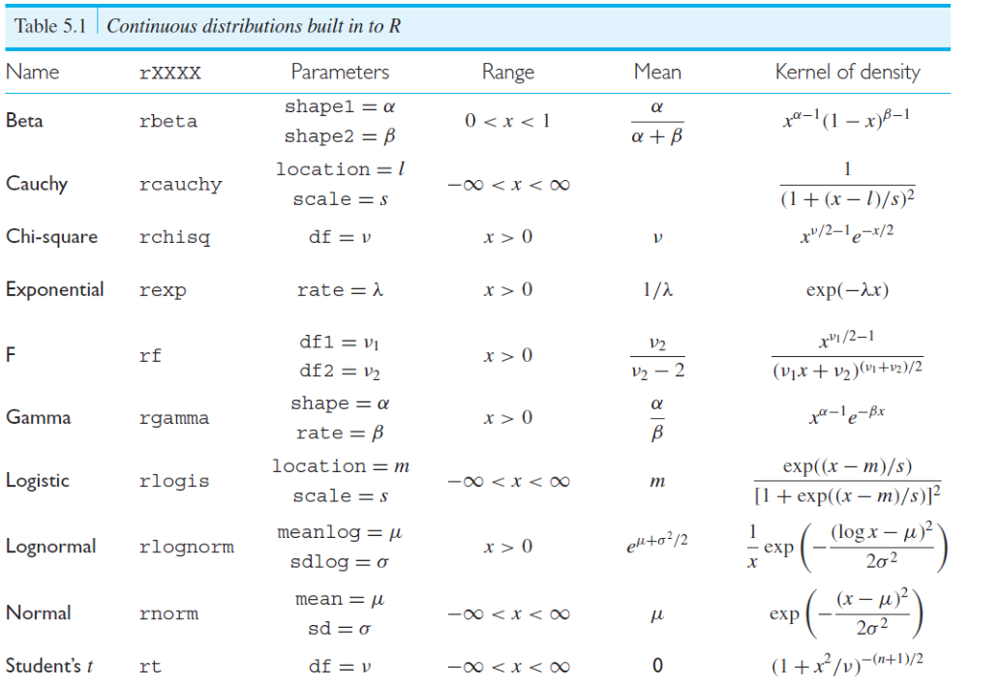
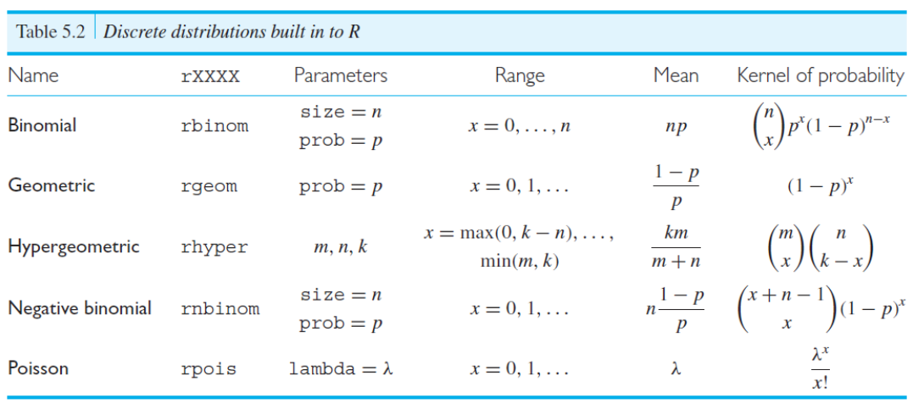

# 模拟其他随机变量
>R语言中提供了四类有关统计分布的函数（密度函数，累计分布函数，分位函数，随机数函数）。分别在代表该分布的R函数前加上相应前缀获得(d，p，q，r)。如：<br>
> 1）正态分布的函数是norm，命令dnorm(0)就可以获得正态分布的密度函数在0处的值(0.3989)(默认为标准正态分布)。<br>
> 2）pnorm(0)是0.5就是正态分布的累计密度函数在0处的值。<br>
> 3）qnorm(0.5)则得到的是0，即标准正态分布在0.5处的分位数是0（在来个比较常用的：qnorm(0.975)就是那个估计中经常用到的1.96了）。<br>
> 4）rnorm(n)则是按正态分布随机产生n个数据。
## Bernoulli Random Variables

```
> set.seed(23207)
> guesses <- runif(20)
> correct.answers <- (guesses < 0.2)
> correct.answers
 [1] FALSE FALSE FALSE FALSE  TRUE  TRUE  TRUE FALSE
 [9]  TRUE  TRUE FALSE FALSE FALSE FALSE FALSE FALSE
[17] FALSE FALSE FALSE  TRUE
```
```
> table(correct.answers)
correct.answers
FALSE  TRUE 
   14     6 
```
## Binomial Random Variables
### 计算p(X=x)
- dbinom(x, size, prob)
- x 是成功的次数，prob是成功的概率，size是实验的次数
```
> dbinom(x = 4, size = 6, prob = 0.5)
[1] 0.234375
```
### 计算p(X <= x)
- pbinom(x , size, prob)
- x 是成功的次数，prob是成功的概率，size是实验的次数
```
> pbinom(4, 6, 0.5)
[1] 0.890625
```
### 计算binomial分布的分位数
- qbinom(p1, size, p2)
- size是实验的次数，p2是成功的概率，p1是成功x次的概率
- 输出是成功的次数x
```
> qbinom(0.89, 6, 0.5)
[1] 4
```
### 产生随机binomial独立同分布序列
- rbinom(n, size, prob)
```
> rbinom(24, 15, 0.1)
 [1] 1 2 2 2 1 0 1 2 2 1 2 3 1 0 1 0 1 0 3 2 2 1 0 2
```
## Possion Random Variables
- dpois
- ppois
- qpois
- rpois
## Exponential Random Variables
- dexp
- pexp
- qexp
- rexp
## 其他内置函数


# 多元随机数生成
## 示例
```
X <- numeric(6)
X[1] <- 100
results <- replicate(5,{
  for (t in 1:5)
    X[t+1] <- X[t]*exp(rnorm(1,mean = 0, sd = log(1.01)))
  X
})
```
```
> results
          [,1]     [,2]      [,3]      [,4]     [,5]
[1,] 100.00000 100.0000 100.00000 100.00000 100.0000
[2,]  99.75338 100.1620  99.58463 100.15686 100.7607
[3,] 102.30194 100.2097  99.02311  99.04906 101.5106
[4,] 100.52979 100.7057 100.27112  98.13373 102.0750
[5,] 101.16904 101.3107  99.45417  99.68271 103.3740
[6,] 100.36274 101.5734  99.90890 100.36490 102.5956
```
## 分析
### 1. rep()与replicate()<br>

> rep()函数把输入的参数重复多次，如果参数是表达式，rep()函数会把表达式的结果重复多次<br>
> replicate()函数是重复调用表达式，每次调用表达式的过程都是独立的
```
> rep(runif(1),5)
[1] 0.8721105 0.8721105 0.8721105 0.8721105 0.8721105
```
```
> replicate(5,runif(1))
[1] 0.9426709 0.1280271 0.1926333 0.7091503 0.5404846
```
### 2. 拆分
```
X <- numeric(6)
X[1] <- 100
results <- replicate(5,{
  for (t in 1:5)
    X[t+1] <- X[t]+1
X+2
})
```
```
> results
     [,1] [,2] [,3] [,4] [,5]
[1,]  102  102  102  102  102
[2,]  103  103  103  103  103
[3,]  104  104  104  104  104
[4,]  105  105  105  105  105
[5,]  106  106  106  106  106
[6,]  107  107  107  107  107
```
### 3. 进一步拆分
```
> for (t in 1:5)
+ {X[t+1] <- X[t]+1}
> X+2
[1] 102 103 104 105 106 107
```
### 4. 结论
&#10084;将x[ ]中的元素随机化，然后以列扩展为5列,每次扩展的随机化之间独立
# 马尔科夫链模拟


