&#9730;Author:chenshuo
# 作业内容
1. 读取 tweet 数据（AAL.xlsx → Stream → Tweet content）；
2. 计算每条 tweet 的四种情感得分；
3. 将得分作为新的数据列与 Stream 数据合并；
<font color = 'red'>
4. 选取任意连续 60 天的所有数据；</font>
5. 将 Date 列转换为日期格式；
6. 将新的日期设置为 index；
7. 挑选出有价值的属性['Hour', 'Tweet content', 'Favs', 'RTs', 'Followers',
'Following', 'Is a RT', 'Hashtags', 'Symbols', 'compound', 'neg', 'neu', 'pos']；
8. 去掉 compound 的得分为 0（即中立）的数据；
9. 去掉 Followers 为空的数据；
10. 增加新的一列 Compound_multiplied，由 compound 和 Followers 相乘而来；
<font color = 'red'>
11. 将Compound_multiplied标准化，作为新的一列Compound_multiplied_scaled；</font>
12. 计算每日所有数据的均值；
13. 将均值结果保存为 excel 表
# 抽取连续60天数据
## 1. 设置index，loc
### 可能的问题：抽取数据后df为空
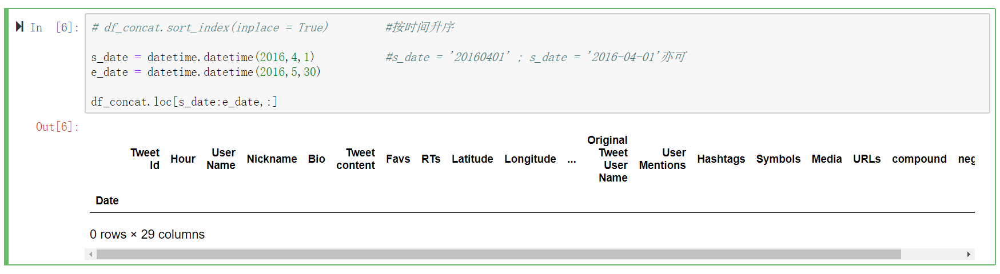
### 问题原因：源文件时间降序
### 解决方法
- 改为升序
```
df_concat.sort_index(inplace = True) 
```
- start_date与end_date对调
```
df_concat.loc[e_date:s_date,:] 
```
## 2. Date column 索引
```
df_concat[(df_concat['Date'] >= '2016-04-01') & (df_concat['Date'] <= '2016-05-30')]
```
# 数据标准化
## 调用standardscaler(score)函数报错
### 问题原因
```
score = df_new['Compound_multiplied'].values
```

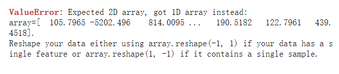
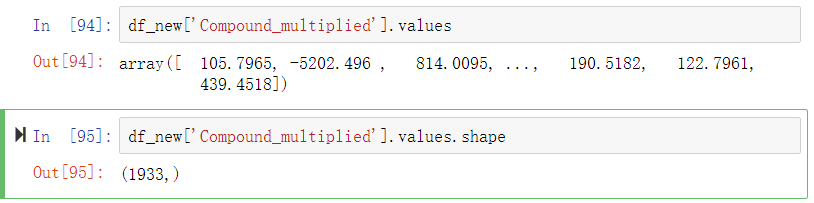
### 解决方法

- reshape(-1,1)
```
score = df_new['Compound_multiplied'].values.reshape(-1,1)
```

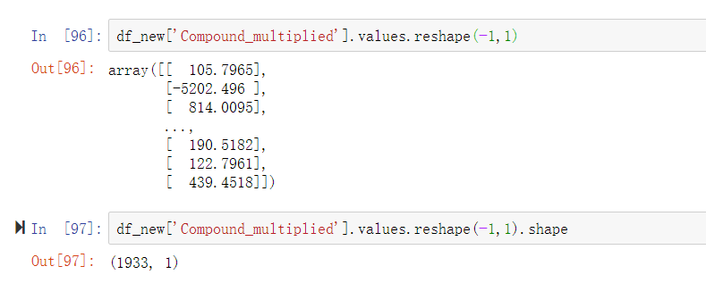

- df[['column']]
```
score = df_new[['Compound_multiplied']].values
```

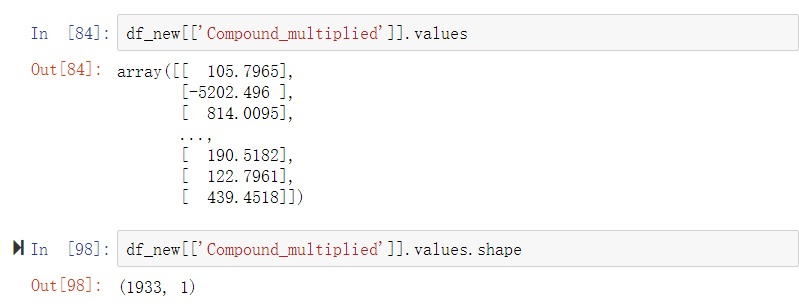

## 几种不同的标准化方法
### StandardScale
- 原理  
  
  $z=\frac{x-mean(x)}{std(x)}$
  
- 调用
```
def standard_scaler(score):                 
    scaler = StandardScaler().fit(score)   #先fit再transform，保存标准化转换器
    scaled_data = scaler.transform(score)
    #scaled_data = StandardScaler().fit_transform(x)   #更高效
    return scaled_data
```
- 实现
```
def standard_scaler_1(x):          #实现StandardScaler
    x = (x - np.mean(x,axis = 0)) / np.std(x, axis = 0)
    return x
```
### MinMaxScaler
- 原理
  
  $z=\frac{x-min(x)}{max(x)-min(x)}$

- 调用
```
def min_max_scaler(x):               #MinMaxScaler
#     scaler = MinMaxScaler.fit(x)
#     scaled_data = scaler.transform(x)
    scaled_data = MinMaxScaler().fit_transform(x)
    return scaled_data             #实现MinMaxScaler
```
- 实现
```
def min_max_scaler_1(x):
    x = (x - np.min(x, axis = 0)) /(np.max(x, axis = 0) - np.min(x, axis = 0))
    return x
```
### MaxAbsScaler
- 原理  
  
  $z=\frac{x}{max(|x|)}$
- 调用
```
def max_abs_scaler(x):          #MaxAbsScaler 
    
    scaled_data = MaxAbsScaler().fit_transform(x)

#     scaler = preprocessing.MaxAbsScaler()
#     scaled_data = scaler.fit_transform(x)
  
    return scaled_data
```
- 实现
```
def max_abs_scaler_1(x):         #实现MaxAbsScaler      
    x = x / np.max(x,axis = 0)
    return x
```
### 更多方法
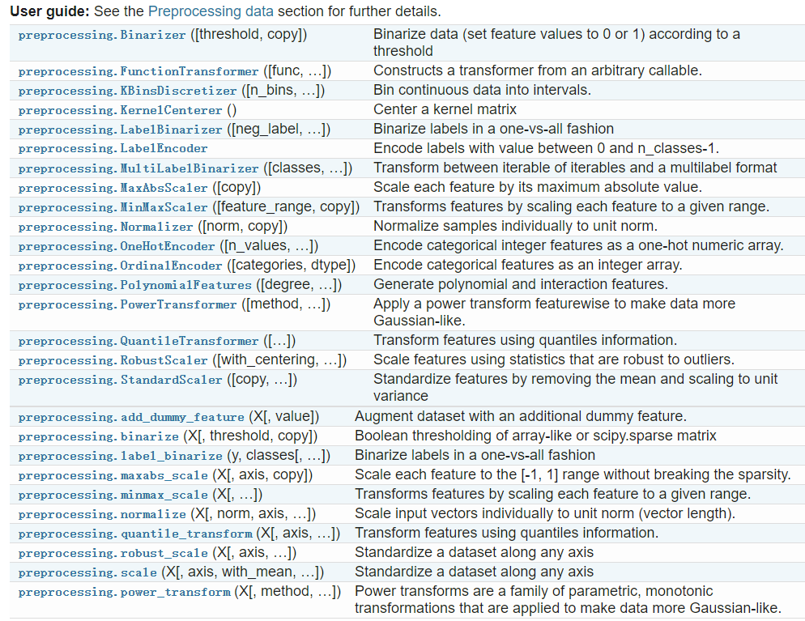
## 不同标准化方法处理数据后的结果
## 一维  

|Compound_multiplied | StandardScale|
| :-: | :-: |
|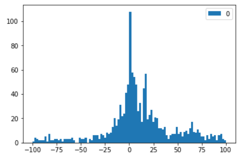|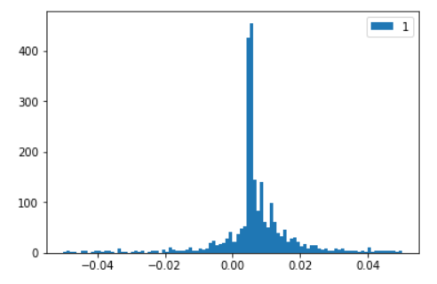
|**MinMaxScaler**|**MaxAbsScaler**|
|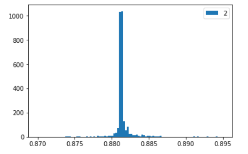|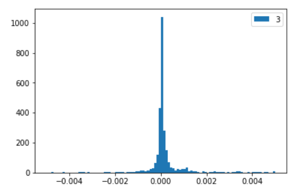
## 二维
- 生成数据
```
X, y = make_blobs(n_samples=50, centers=2, random_state=4, cluster_std=1)
```
- 结果分析

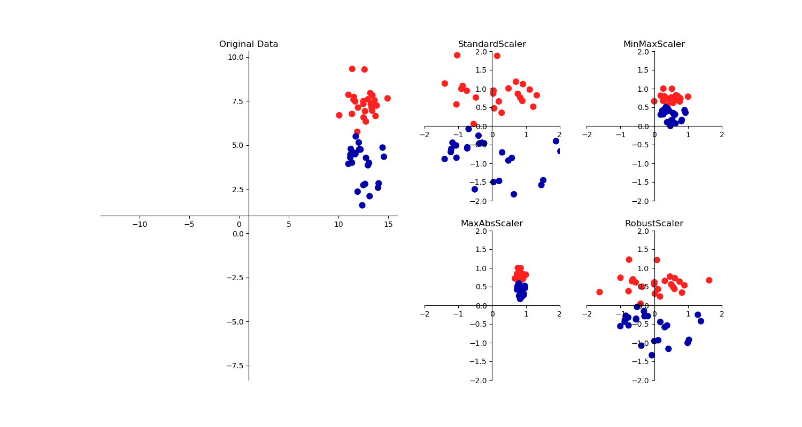
## 数据标准化的作用
- 无量纲化，便于不同评价指标的比较
- 弱化奇异值对模型的影响
- 加快梯度下降求最优解的速度  

| 未归一化 | 归一化 |
| :-: | :-: |
|$J = (3\theta_{1} + 600\theta_{2} - y_{correct})^{2}$|$(0.5\theta_{1}+0.55\theta_{2}-y_{correct})^{2}$
| 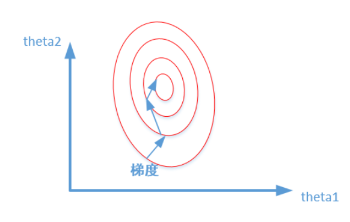|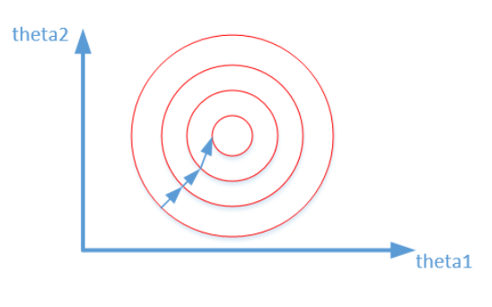


参考资料
>《python机器学习基础教程》——人民邮电出版社 <br>
>知乎：https://zhuanlan.zhihu.com/p/27627299  
