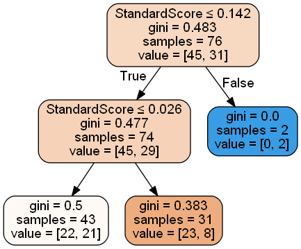

# KNN
## 调整超参
| |k = 1 | k = 3| k = 5 | k = 7 | k = 9|
| :-: | :-: | :-: | :-: | :-: | :-: |
|train_score| 1.000000|0.828947	|0.776316 |0.750000 |0.644737 |
|cv_val_mean|0.553333 |	0.515000 |0.635000 |0.581667 |0.657500	 |
|test_score|0.50 |0.60|0.60 | 0.65|0.70 |
- k = 1，3时，模型复杂，approximation error很小， estimation error大，过拟合、泛化能力差
- k = 5， 7时，bias相对较小，但是train_score和cv_cal_mean相差比较大，泛化能力也一般
- k = 9时，模型简单，bias大，但是train_score和cv_val_mean相差不大，模型稳定，泛化能力也不错
## knn的实现
```
import numpy as np
import pandas as pd
from collections import Counter


class Knn:
    def __init__(self, X_train, y_train, n_neighbors=5, p=2):
        self.X_train = X_train
        self.y_train = y_train
        self.n = n_neighbors
        self.p = p

    def predict(self, x_test):

        knn_list = []

        for i in range(self.n):
            distance = np.linalg.norm(x_test - self.X_train[i], ord=self.p)

            knn_list.append((distance, self.y_train[i]))

        for i in range(self.n, len(self.X_train)):

            distance = np.linalg.norm(x_test - self.X_train[i], ord=self.p)

            if max(knn_list, key=lambda x: x[0])[0] > distance:
                knn_list[knn_list.index(max(knn_list, key=lambda x: x[0]))] = (distance,self. y_train[i])

        knn_label = [x[-1] for x in knn_list]
        label_count = Counter(knn_label)
        predict_label = sorted(label_count.items(), key=lambda x: x[-1])[-1][0]   #高阶函数

        return predict_label

    def score(self, X_test, y_test):

        correct_number = 0

        for x, y in zip(X_test, y_test):

            if self.predict(x) == y:
                correct_number += 1

        accuracy = correct_number / len(X_test)

        return accuracy
```


# LogReg
## 调整超参  
| |C = 0.1| C = 1 | C = 2|C = 3|C = 4|
| :-: | :-: | :-: |:-: | :-: | :-: |
|train_score|0.592105|0.592105|0.592105|0.592105|0.605263|
|cv_val_mean|0.591270|0.591270|0.591270|0.591270|0.591270|
|test_score|0.65|0.65|0.65|0.65|0.65|
# SVM
## 调整超参  
| | C = 0.1|C = 1| C = 2| C = 3|
| :-: | :-: | :-: | :-: | :-: |
|train_score| 0.592105 | 0.592105| 0.592105|0.605263 |
|cv_val_mean|0.591270|0.591270 |0.591270 |0.591270 |
|test_score|0.65 |0.65 | 0.65|0.65 |

# Decision Tree
## 调整超参  
| |max_depth = default| max_depth = 5 | max_depth = 4 |max_depth = 3| max_depth = 2 |
| :-: | :-: | :-: | :-: | :-: | :-: |
|train_score| 1.000000| 0.789474|0.723684|0.697368 |0.618421 |
|cv_val_mean| 0.605641|0.539487 |0.605128 |0.565641 |0.591795 |
|test_score| 0.50|0.55 | 0.50|0.55 |0.60 |
- 对节点最大深度不加约束时，模型复杂，approximation error小(0误差)， estimation error大，过拟合、泛化能力差
- 只有max_depth test_score为0.6 。其他的就不看了。决策树不适合（盲猜全负都有0.6的命中率）
## 决策树的实现
```
import numpy as np
from collections import Counter
from math import log

class Node():
    def __init__(self):
        self.label = None
        self.ax = None
        self.parent = None
        self.children = {}


class DecisionTree():

    def __init__(self,epsilon = 0.1):
        self.root = Node()
        self.epsilon = epsilon
        # self.d = len(y_train)

    def entropy(self,labels):
        y = Counter(labels)  # y[k] y_train中值为k的 数量
        len_y = len(labels)

        entropy_d = -sum([y[k] / len_y * log(y[k] / len_y, 2) for k in y.keys()]) # + 1e-10

        return entropy_d

    def cdt_entropy(self, ax, data, labels):

        xc = Counter(data[:, ax])  # X_train某一列进行counter

        sum = 0
        for i, j in zip(xc.keys(), xc.values()):  # 遍历X_train中所有不同取值 i

            tmp = j  # Di = j

            idx = [x for x, y in enumerate(data) if y[ax] == i]  # 返回X_train中值为i的全部索引

            label_counter = Counter(labels[idx])
            sum1 = 0
            for m, n in zip(label_counter.keys(), label_counter.values()):
                sum1 += (n / tmp) * log(n / tmp, 2)

            sum += tmp / len(labels) * sum1
        cdt_entropy = - sum
        return cdt_entropy

    def info_gain(self,ax, data, labels):

        return self.entropy(labels) - self.cdt_entropy(ax, data, labels)

    def fqt_label(self,labels): #返回labels中频数最高的label

        fqt = sorted(Counter(labels).items(), key = lambda x:x[-1])[-1][0]

        return fqt


    def bulid_tree(self, curr_node,sub_data,sub_labels,curr_axises):
        '''
        input: dataset, feature/axis, epsilon
        output: T
        :return:
        '''


        unique_label = list(set(sub_labels)) # unique label
        #若所有实例属于同一类，单节点树，返回该label
        if len(unique_label) == 1:
            curr_node.label = unique_label[0]  #而非self.node
            return
        #若feature 为空，将dataset中label 频数最高的作为结点的label

        if not curr_axises:
            curr_node.label = self.fqt_label(sub_labels)
            return

        info_gain_list = []
        for ax in curr_axises:  #获取每个feature的entropy; axises存储
            info_gain = self.info_gain(ax, sub_data, sub_labels)
            info_gain_list.append(info_gain)

        if max(info_gain_list) <self.epsilon:
            curr_node.label = self.fqt_label(sub_labels)

            return
        idx = info_gain_list.index((max(info_gain_list)))  #max information gain indx
        ag = curr_axises.pop(idx)  #ag = max information gain feature
        curr_node.ax = ag     #记录当前用于分类的feature（max information gain）
        ax_data = sub_data[:, ag] # subdataset when feature = ag(classify feature)
        ax_unique = set(ax_data)

        for ax in ax_unique:
            tmp_idx = np.argwhere(ax_data == ax).flatten()
            child_node = Node() #new empty Node
            child_node.parent = curr_node
            curr_node.children[ax] = child_node
            child_labels = sub_labels[tmp_idx]   ###
            child_data = sub_data[tmp_idx]      ###
            self.bulid_tree(child_node,child_data,child_labels,curr_axises)
        return

    def fit(self, data, labels):
        features = data.shape[1]  #features 总数
        axies = list(range(features))          ########
        self.bulid_tree(self.root, data, labels, axies)

    def predict(self, test_data, test_labels):
        counts = 0
        test_size = test_labels.size
        for i in range(test_size):  #遍历test样本
            tmp_node = self.root
            while tmp_node.children:
                ax = tmp_node.ax
                val = test_data[i, ax]
                tmp_node = tmp_node.children[val]        #### continus variables
            if tmp_node.label == test_labels[i]:
                counts += 1
        accuracy = format(counts / test_size, '.5f')

        return accuracy
```
  
# Random Froest
## 调整超参  
| |max_depth = default| max_depth = 5 | max_depth = 4 |max_depth = 3| max_depth = 2 |
| :-: | :-: | :-: | :-: | :-: | :-: |
|train_score|0.657895|0.657895|0.657895|0.657895|0.657895|	
|cv_val_mean|0.631667|0.631667|0.631667|0.631667|0.618333|
|test_score|0.65|0.65|0.65|0.65|0.65|

# 附件一:max_depth = default决策树的图

# 附件二：max_depth = 2 决策树的图



