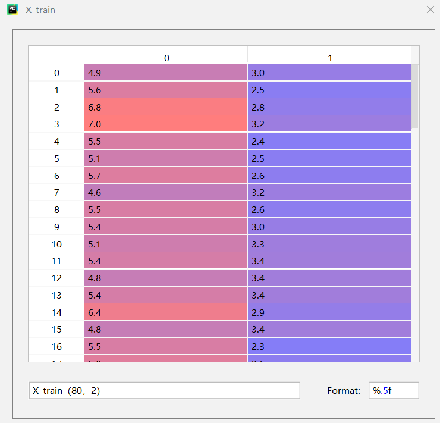
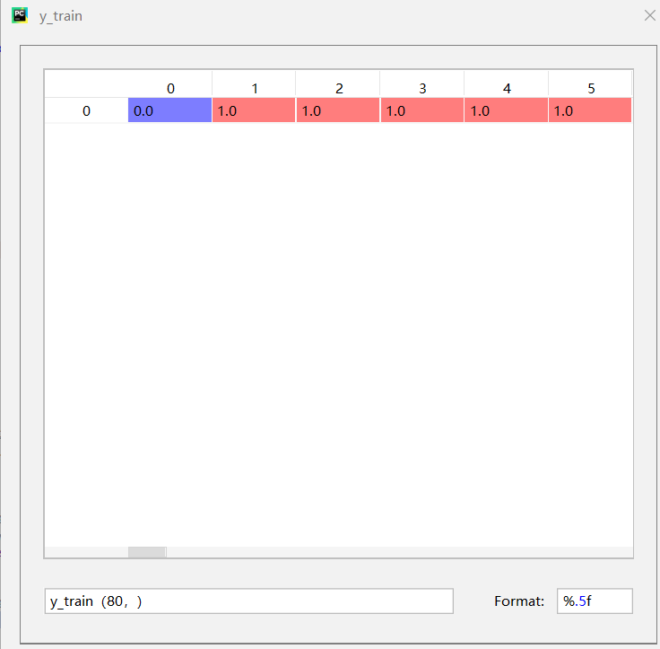
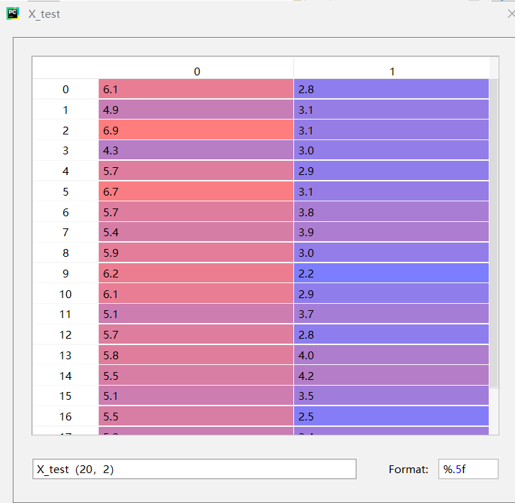
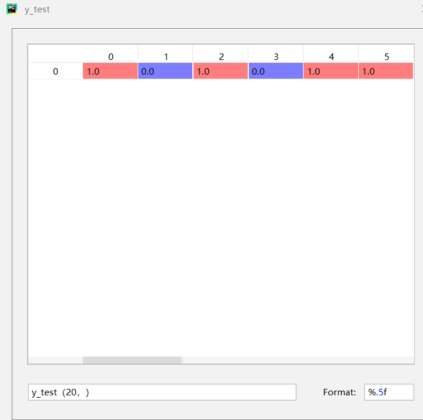
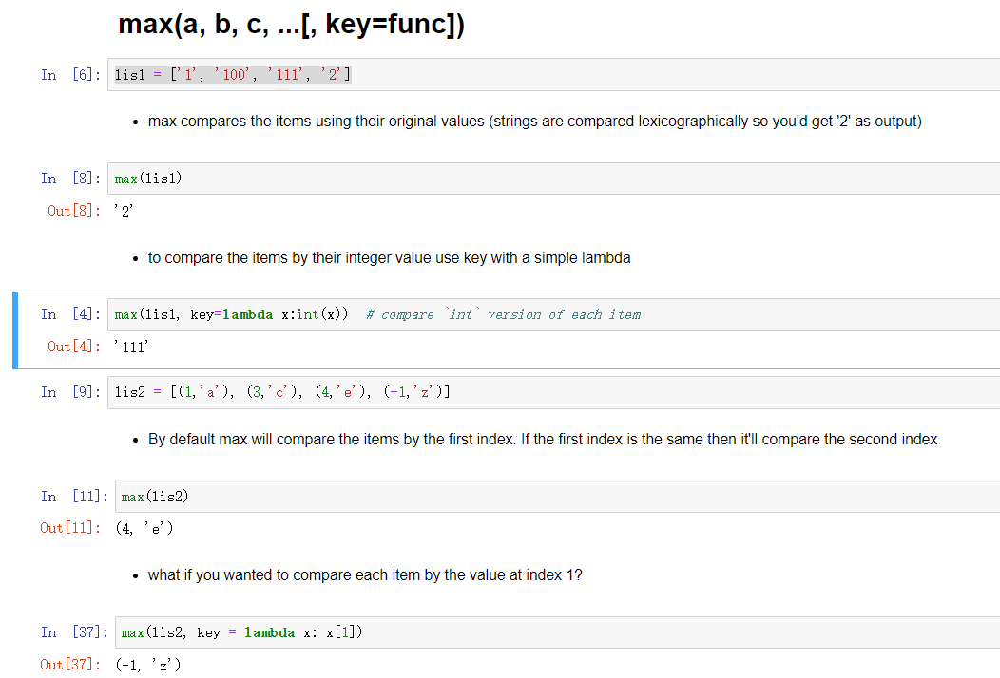
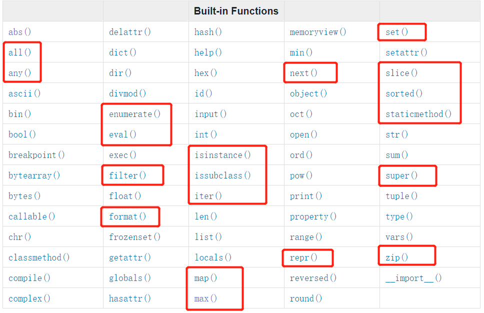
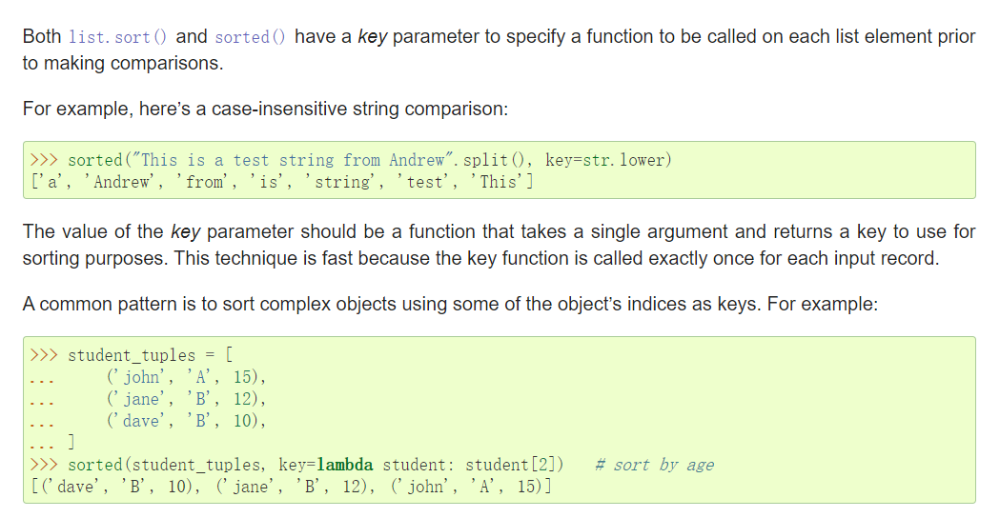
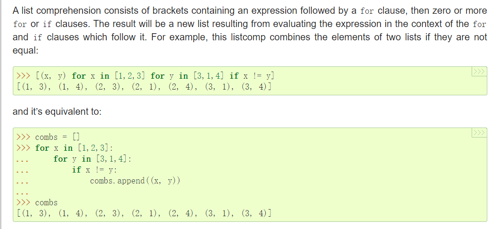
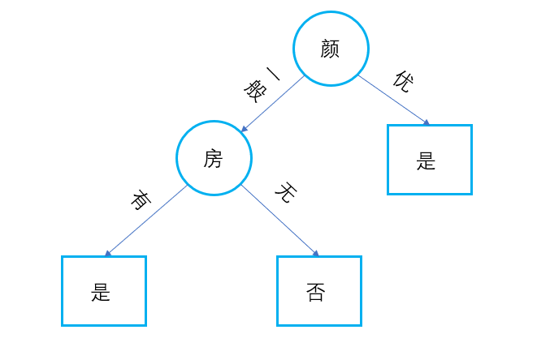
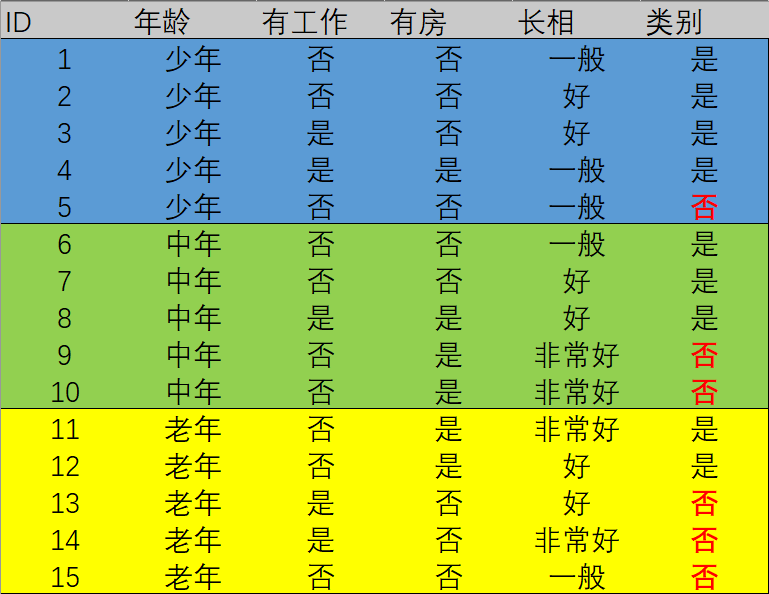

>&#9730;Author:陈烁
# KNN
## 数据(一个feature数据在$L_p$距离时不好说明)

|||
|:-:|:-:|
|||
|||   
## 两个问题：
- 给定单个test sample，预测相应的label（分类）
- 计算test dataset分类正确率
## 两个函数的输入输出：


```
    def predict(self, x_test): 
        '''

        :param x_test: ndarray (features_n,)
        :return: predict_label , real number
        '''
```
```
    def score(self, X_test, y_test):
        '''

        :param X_test: ndarray, (test_size,feature_n)
        :param y_test: ndarray, (test_size,)
        :return: accuracy: real number
        '''
```
## 两个函数的实现：
### predict function
>预备补充知识
>- 监督学习基本假设：联合概率分布
>- $P(Y|X)=\frac{P(X,Y)}{P(X)}$
>- 判别与生成
####  knn基本原理 
- 选择距离最近的k个样本
- k个样本中频数最高的label作为$\hat{y}_{test}$
#### 分析：
- 谁和谁的距离:  
   x_test(features_n,)与X_train(train_size = m,features)的 m 个距离，选最近的k个距离
- 距离怎么度量:  
    $(\sum_{l=1}^{n}|x_{i}^{(l)}-x_{j}^{(l)}|^{p})^{\frac{1}{p}} \Longrightarrow$np.linalg.norm() 
```
 distance = np.linalg.norm(x_test - self.X_train[i], ord = self.p)

```
- 怎么选出k个最近的样本（举个栗子解释）----搜索——两个for loop
```
knn_list = [] #存储(distance,label)
```
```
        for i in range(self.n):

            distance = np.linalg.norm(x_test - self.X_train[i], ord = self.p)

            knn_list.append((distance, self.y_train[i]))

```
```
        for i in range(self.n, len(self.X_train)):

            distance = np.linalg.norm(x_test - self.X_train[i], ord=self.p)

            #knn_list [(distance1,label1),(distance2,label2),...]

            if max(knn_list, key=lambda x: x[0])[0] > distance:
                knn_list[knn_list.index(max(knn_list, key=lambda x: x[0]))] = (distance,self. y_train[i])
```

>Built-in Functions:https://docs.python.org/3/library/functions.html

- 怎么统计：Counter
```
#knn_list [(distance1,label1),(distance2,label2),...(distance_k,label_k)]

        knn_label = [x[-1] for x in knn_list] 

#knn_label [label1,label2,...label_k]  

        label_count = Counter(knn_label)   #Counter({label1:n1, label2:n2, ...})
        predict_label = sorted(label_count.items(), key= lambda x: x[-1])[-1][0]   
        #<scaler variable> C.items()convert to a list of (elem, cnt) pairs
```
|||
|:-:|:-:|
||
>sorted:https://docs.python.org/release/3.7.4/howto/sorting.html#sortinghowto  

>list_comprehension:https://docs.python.org/3.8/tutorial/datastructures.html#list-comprehensions    

>Counter:https://docs.python.org/3/library/collections.html?highlight=counter#collections.Counter
### score function
```
 def score(self,X_test, y_test):

        correct_number = 0

        for x, y in zip(X_test, y_test):

            if  self.predict(x) == y:
                correct_number += 1

        accuracy = correct_number/len(X_test)   
```
>zip:https://docs.python.org/3.8/library/functions.html#zip
### final version
```
class Knn:
    def __init__(self, X_train, y_train, n_neighbors=5, p=2):
        self.X_train = X_train
        self.y_train = y_train
        self.n = n_neighbors
        self.p = p

    def predict(self, x_test):
        '''

        :param x_test: ndarray (feature_n,)
        :return: predict_label , real number
        '''
        knn_list = []

        for i in range(self.n):
            distance = np.linalg.norm(x_test - self.X_train[i], ord=self.p)

            knn_list.append((distance, self.y_train[i]))

        for i in range(self.n, len(self.X_train)):

            distance = np.linalg.norm(x_test - self.X_train[i], ord=self.p)

            if max(knn_list, key=lambda x: x[0])[0] > distance:
                knn_list[knn_list.index(max(knn_list, key=lambda x: x[0]))] = (distance,self. y_train[i])

        knn_label = [x[-1] for x in knn_list]
        label_count = Counter(knn_label)
        predict_label = sorted(label_count.items(), key=lambda x: x[-1])[-1][0]   #高阶函数

        return predict_label

    def score(self, X_test, y_test):
        '''

        :param X_test: ndarray, (test_size,feature_n)
        :param y_test: ndarray, (test_size,)
        :return: accuracy: real number
        '''

        correct_number = 0

        for x, y in zip(X_test, y_test):

            if self.predict(x) == y:
                correct_number += 1

        accuracy = correct_number / len(X_test)

        return accuracy

```
- 待改进与完善：搜索（感兴趣可实现）

# DecisionTree
- 决策树——我的理解
- 实现思路
- 代码实现 
## 决策树是什么  
|||
|:-:|:-:|
|||
## 一些概念
### 熵(信息论)：
- $H(X) = \sum_{i=1}^{n}p_i(-logp_i)$
- 平均信息量，熵越大，随机性越大
### 条件熵(公式略，举例计算), 信息增益，ID3,C4.5,CART，基尼指数
```
class Node():
    def __init__(self):
        self.label = None
        self.ax = None
        self.parent = None
        self.children = {}


class DecisionTree():

    def __init__(self,epsilon = 0.1):
        self.root = Node()
        self.epsilon = epsilon

    def entropy(self,labels):
        y = Counter(labels)  # y[k] y_train中值为k的 数量
        len_y = len(labels)

        entropy_d = -sum([y[k] / len_y * log(y[k] / len_y, 2) for k in y.keys()]) # + 1e-10

        return entropy_d

    def cdt_entropy(self, ax, data, labels):

        xc = Counter(data[:, ax])  # X_train某一列进行counter

        sum = 0
        for i, j in zip(xc.keys(), xc.values()):  # 遍历X_train中所有不同取值 i

            tmp = j  # Di = j

            idx = [x for x, y in enumerate(data) if y[ax] == i]  # 返回X_train中值为i的全部索引

            label_counter = Counter(labels[idx])
            sum1 = 0
            for m, n in zip(label_counter.keys(), label_counter.values()):
                sum1 += (n / tmp) * log(n / tmp, 2)

            sum += tmp / len(labels) * sum1
        cdt_entropy = - sum
        return cdt_entropy

    def info_gain(self,ax, data, labels):

        return self.entropy(labels) - self.cdt_entropy(ax, data, labels)

    def fqt_label(self,labels): #返回labels中频数最高的label

        fqt = sorted(Counter(labels).items(), key = lambda x:x[-1])[-1][0]

        return fqt


    def bulid_tree(self, curr_node,sub_data,sub_labels,curr_axises):
        '''
        input: dataset, feature/axis, epsilon
        output: T
        :return:
        '''


        unique_label = list(set(sub_labels)) # unique label
        #若所有实例属于同一类，单节点树，返回该label
        if len(unique_label) == 1:
            curr_node.label = unique_label[0]  #而非self.node
            return
        #若feature 为空，将dataset中label 频数最高的作为结点的label

        if not curr_axises:
            curr_node.label = self.fqt_label(sub_labels)
            return

        info_gain_list = []
        for ax in curr_axises:  #获取每个feature的entropy; axises存储
            info_gain = self.info_gain(ax, sub_data, sub_labels)
            info_gain_list.append(info_gain)

        if max(info_gain_list) <self.epsilon:
            curr_node.label = self.fqt_label(sub_labels)

            return
        idx = info_gain_list.index((max(info_gain_list)))  #max information gain indx
        ag = curr_axises.pop(idx)  #ag = max information gain feature
        curr_node.ax = ag     #记录当前用于分类的feature（max information gain）
        ax_data = sub_data[:, ag] # subdataset when feature = ag(classify feature)
        ax_unique = set(ax_data)

        for ax in ax_unique:
            tmp_idx = np.argwhere(ax_data == ax).flatten()
            child_node = Node() #new empty Node
            child_node.parent = curr_node
            curr_node.children[ax] = child_node
            child_labels = sub_labels[tmp_idx]   ###
            child_data = sub_data[tmp_idx]      ###
            self.bulid_tree(child_node,child_data,child_labels,curr_axises)
        return

    def fit(self, data, labels):
        features = data.shape[1]  #features 总数
        axies = list(range(features))          ########
        self.bulid_tree(self.root, data, labels, axies)

    def predict(self, test_data, test_labels):
        counts = 0
        test_size = test_labels.size
        for i in range(test_size):  #遍历test样本
            tmp_node = self.root
            while tmp_node.children:
                ax = tmp_node.ax
                val = test_data[i, ax]
                tmp_node = tmp_node.children[val]        #### continus variables
            if tmp_node.label == test_labels[i]:
                counts += 1
        accuracy = format(counts / test_size, '.5f')

        return accuracy
```
# 算法实现的收获：


